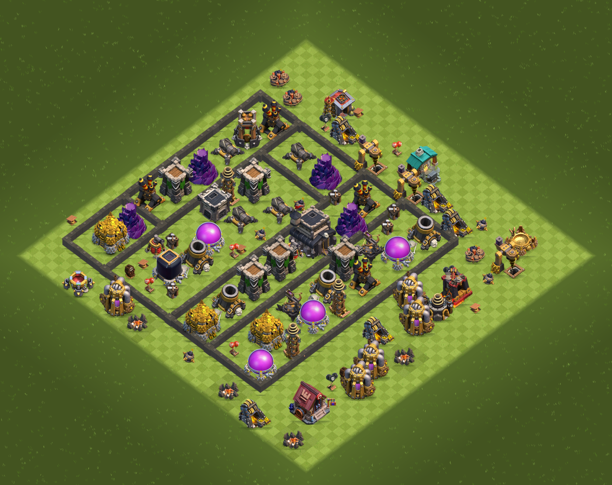

# coc-synth

A synthetic data generator for Clash of Clans base layouts, with exact
ground-truth labels, built to train a computer-vision model.



## Why this exists

Detection models are usually trained on datasets where the object of interest
is one thing filling a third of the frame. That's not the hard case. The hard
case is many small, similarly-shaped objects packed close together, at
consistent scale, where the model has to tell a Cannon from a Mortar from six
pixels of silhouette difference. Clash of Clans base layouts are close to an
ideal source for training that: dozens of distinct object types per image,
tight packing, real occlusion, and — because a base is built from known rules
rather than photographed — labels that can be *exact* instead of hand-drawn.

That last part is what this project does. `cocsynth` places buildings on a
44×44 grid under the game's actual unlock/count/level rules for a given Town
Hall, renders the result isometrically, and emits a label file where every
box, polygon, and visibility fraction is measured from what was actually
drawn — not estimated.

**No packed game files, textures, or data were extracted from the client or
its servers to build this.** Building counts and unlock rules come from a
public community-maintained dataset ([source](https://github.com/chiefpansancolt/clash-of-clans-data)).
Art is either from that same public source or cut directly out of the
project author's own gameplay screenshots. See [Art](#art) below for exactly
which is which.

## Quickstart

```bash
pip install -r requirements.txt

python -m cocsynth.generate --th 9 --n 500 --out data/th9 --seed 42 --formats json,yolo
python -m cocsynth.generate --th 1-9 --n 5000 --out data/mixed --seed 1
python -m cocsynth.generate --th 9 --n 4 --out data/debug --overlay   # eyeball the labels
```

Output:

```
data/th9/
  images/th9_000000.png       rendered base
  labels/th9_000000.json      ground truth
  overlays/th9_000000.png     boxes + footprints + facings drawn on  (--overlay)
  yolo/labels/*.txt, data.yaml                                        (--formats yolo)
  dataset.json                settings, counts, placeholder coverage
```

## How it fits together

| Piece | File | Role |
|---|---|---|
| Rules | `config/buildings.yaml` | per-TH unlock / count / max-level, generated from upstream game data |
| Catalog | `cocsynth/catalog.py` | loads and re-validates the rules |
| Placement | `cocsynth/placement.py` | legal, wall-first random layout on the 44×44 grid |
| Projection | `cocsynth/project.py` | isometric tile ↔ pixel, at the game's *measured* aspect |
| Sprites | `cocsynth/assets.py` | real art with level/direction fallback and per-file scale |
| Renderer | `cocsynth/render.py` | compositing, terrain, shadows, and an instance-id mask |
| Labels | `cocsynth/labels.py` | the ground-truth JSON |
| Export | `cocsynth/export_yolo.py` | YOLO txt + `data.yaml` |
| Overlay | `cocsynth/overlay.py` | draws ground truth back onto the image, for sanity-checking |

## The rules are the point

`config/buildings.yaml` is the single source of truth and is **generated**, not
hand-written — transcribing per-TH count tables by hand is how you end up with
two Eagle Artilleries at TH8:

```bash
python tools/import_game_data.py --max-th 9
```

It pulls numeric data (footprints, per-TH counts, level requirements) from
[chiefpansancolt/clash-of-clans-data](https://github.com/chiefpansancolt/clash-of-clans-data)
at a pinned commit. No art is downloaded by this step. A building with no
entry at a Town Hall level cannot be placed there at all, and the caps are
what the work list is built *from*, so they cannot be exceeded.
`tests/test_placement.py` asserts this over hundreds of random bases, and also
that a Town Hall's own level always equals the base's declared Town Hall.

## Geometry, measured rather than assumed

The most time-consuming part of this project was not the placement logic —
it was getting the *picture* right, and every number below came from
measuring real screenshots rather than eyeballing them.

- **The tile is 4:3, not the textbook 2:1 isometric diamond.**
  `tile_h = 0.75 * tile_w`. Measured independently four ways — sub-pixel
  lattice-shift correlation, FFT, and a line fit to the buildable diamond's
  own four edges — across two different game clients, agreeing to within
  0.25%. The camera is orthographic: the lattice period is identical at the
  top, middle, and bottom of the grid, so there's no perspective to model.
- **The ground is a two-tone tile checkerboard**, not a flat or noisy green
  fill, coloured from the actual light/dark tile values measured off a real
  base (with the grass grain filtered out first — measuring on raw quantiles
  reads grain as contrast and overstates it by ~3×).
- **Buildings stand at the centre of their footprint**, not anchored to its
  south vertex. The old anchoring is only correct if a sprite's art fills its
  entire footprint diamond, which it does not, and it was hanging every
  building a tile-width too low.
- **Wall segments autotile.** A 4-bit connection mask (which of N/E/S/W has a
  neighbouring wall) is computed at placement time and used as a lookup axis
  for sprite selection, so a straight run, a corner, a T-junction, and a lone
  post are each their own art rather than one sprite repeated — matching how
  the game actually draws walls as a row of joined posts, not a continuous
  bar.

## Art

Two sources, and the repo is explicit about which type uses which
(`assets/sprites/manifest.json` records it per file):

1. **Published icons** from the community dataset above, for types not yet
   re-sourced. These are *shop icons*, framed to fill their own canvas —
   which means they carry no usable footprint information on their own (an
   Army Camp icon is just its campfire, not the camp). They're rescaled per
   type against a measured fill factor, not assumed to fill their diamond.
2. **Cut directly from the author's own gameplay screenshots** (`reference/`),
   for types where that's been done — walls and nine building types so far.
   A cut sprite is already at the game's own scale, so no correction factor
   is needed at all; this is more accurate than (1) and is where the project
   is heading for full Town Hall coverage. `tools/cut_sprites.py` and
   `tools/cut_walls.py` do the cutting; crop boxes are chosen by hand
   (`reference/cut_th1.json`), because no automatic segmentation reliably
   tells a standing villager apart from the building next to them.

See [assets/README.md](assets/README.md) for the sprite folder contract and
the level/mirror fallback rules.

## Rotation

Most buildings have a fixed orientation. Some do not — the **Air Sweeper**
(TH6+) has a player-set facing, 8 headings 45° apart. This is a real label
dimension, driven by `directions:` in the catalog.

Facing changes the sprite and firing arc, not the tiles consumed, so it's
sampled after collision and never interacts with placement.

Plain YOLO boxes have no orientation slot, hence `--yolo-direction-mode`:
`ignore` (default; facing stays in the JSON) or `split` (one class per facing).

## Labels

```json
{
  "id": 7, "type": "air_sweeper", "level": 2,
  "tile": [14, 26], "footprint": [2, 2],
  "direction": 5, "heading": "SW", "rotation_deg": 225,
  "connections": 0,
  "bbox_px": [420, 512, 64, 72],
  "footprint_polygon_px": [[...], [...], [...], [...]],
  "visibility": 0.88,
  "sprite": "air_sweeper_lvl02_dir5.png"
}
```

* `bbox_px` is measured from rendered alpha via an instance-id mask, not
  approximated from the footprint — an isometric sprite stands well above its
  tile, so a box derived from the diamond alone is the wrong box.
* `visibility` is the fraction not occluded by a nearer building. Instances
  below `--min-visibility` are dropped from the label entirely: asking a
  model to detect something invisible teaches it to hallucinate.
* `connections` is the wall autotile mask (N=1, E=2, S=4, W=8), 0 for
  non-wall types.
* `sprite` records what was actually used, so a dataset can be audited for
  how much placeholder vs. real art went into it.
* `seed` + `grid` reproduce any image exactly: `--only <index>` re-renders it
  byte-for-byte.

## A first trained model

`models/best.pt` — YOLO11n, 40 epochs on 400 synthetic TH1–2 images. It
reaches mAP50 0.987 on a *synthetic* validation split, which only shows the
labels are internally consistent — it has not yet been evaluated against a
real screenshot, which is the test that actually matters and the immediate
next step.

## Current state and known gaps

Kept up to date, deliberately unflattering, in **[STATUS.md](STATUS.md)**:
what's measured vs. assumed, what's visibly still wrong (no obstacles, no
background terrain, incomplete level coverage), and — worth reading before
proposing a fix — what's already been tried and abandoned, and why.

## Tests

```bash
python -m pytest tests/ -q
```

Requires Pillow, numpy, pydantic, PyYAML, pytest. `rembg` is optional (only
`tools/ingest_sprites.py --cutout`). Deliberately no opencv or ultralytics for
the generator itself — those belong to the training half.
